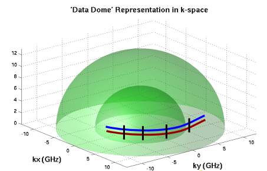

## 基于模型的成像和特征提取

### 1.问题的框架

#### 图像的进一步处理

SAR图像的进一步处理：提取特征；进行推理

关键假设是：对图像可以进行低维的表示

#### 基于模型的成像和推断

- 参数模型编码散射机制的先验信息

- 散射机制给出了新的方向：宽角度SAR成像；3D重建

- 估计理论给出了预测结果，同时主要受限于特征精度

- 根据特征匹配来分类：特征的不确定性影响到识别的识别可行度

### 2.合成孔径雷达概述

#### SAR数据采集

在每个点测量散射值：   $E(f,\phi,\theta),f\in[f_{min},f_{max}]$

采集数据从极坐标到直角坐标转换：$\left( f,\phi \right)\leftrightarrow \left( {{f}_{x}},{{f}_{y}} \right)$

- 其范围从$\left( \left( 1-{\beta }/{2}\; \right){{f}_{c}},\left( 1+{\beta }/{2}\; \right){{f}_{c}} \right),\left( {-{{\phi }_{m}}}/{2}\;,{{{\phi }_{m}}}/{2}\; \right)\leftrightarrow \Delta {{f}_{x}},\Delta {{f}_{y}}$

#### SAR分辨力

SAR图像对理想点散射体的响应是一些可分离的sinc函数，分辨力由峰值的3dB带宽决定

#### SAR图像形成

直角坐标系下的重采样数据→SAR成像器（加窗、补零、二维IFFT）→SAR图像

#### 传统的图像形成的问题

- 假设为各向同性的点散射体：目标上的点散射体没有扩展且对于频率变化响应恒定

$E\left( f,\phi \right)=A{{e}^{j\frac{4\pi }{c}\left[ {{x}_{0}}{{f}_{x}}+{{y}_{0}}{{f}_{y}}+{{z}_{0}}{{f}_{z}} \right]}}$

- 图像形成是一个伴随算子（不可逆），即图像是成像的匹配滤波器算子输出到各向同性的散射中心位置(x,y)；分辨率和旁瓣是关于窗函数选择的折衷

### 3.雷达散射的参数模型

#### 散射物理机制

- 在足够高的分辨率下，独立的散射中心是可分的

- 分离的散射中心的**相位、幅度、极化**特征是于目标形状相关的且是稳定的

#### 建模雷达散射中心

- 提出简洁的参数散射模型
  - 使数据量减少
  - 反映足够的统计信息

- 编码关于散射机制的先验信息
  - 几何绕射理论GTD
  - 物理光学PO
- 估计有物理意义的参数

#### 属性散射中心模型ASCM

散射参数的含义：

#### 散射原型散射体

三面角（角散射体）、二面角、帽顶、圆柱、球、平面边缘

散射取决于频率和角度，而**极化参数**可以允许对从雷达测量中得到的散射原型散射体进行区分

**idea？**：*一直疑惑就算同一种基本散射体类型，其大小和取向等变化的话，它们的散射测量对应的基本散射类型不就会发生改变吗？*

*当前自己的理解：散射体的判别是“**数据→散射体类型** ”，是特定于一定条件下的测量数据的判别结果，数据变的话，散射体类型判别的结果也就变了，尽管原始成像目标没有变*

#### 局部vs.分布散射体

#### 参数估计方法

##### 直接从测量数据$E\left( f,\phi \right)$​中估计

- 高维模型（在平面数据的情况下都有7个参数）
- 高数据维度
- 优化问题复杂

##### 从已经成像的复图像$E\left( x,y \right)$中估计

- 一对一的变换（成像过程是没有信息损失的）
- 分割为更小的问题求解
- 低复杂度；更优的条件性

#### 近似最大似然参数估计Approximate Maximum Likelihood Parameter Estimation

1. 原始复SAR图像→分水岭分割：图像域专注于少量像素的散射信息
2. 分割部分→估计的图像：在小区域上拟合最大似然模型；非线性最小二乘
3. 估计的部分图像→从原始复SAR图像中移除：为了计算效率，迭代模型
4. 迭代进行

#### 参数不确定性

引入估计理论（Estimation Theory），计算属性不确定性和不确定性边界：

- 统计估计误差
- Cramer-Rao 界

#### 局部和分布的结构选择

局部和分布散射中心参数不同，需根据给定的SAR数据，确定散射体结构

结构选择：**广义似然比测试GLRT**

例子 $d$​ :一个图像区域内的像素的向量

可以画出$P_d$和$P_FA$的关系曲线（正确和错误判断结构类型的概率的关系曲线）

### 4.宽角度SAR

motivation：更优的INS *什么是INS* ；无人机UAV，串联工作多无人机 ；近程接收机双站雷达

宽角度SAR研究：分辨率和成像性质；对散射持续性的影响

#### 宽角度SAR图像响应的特点

**宽的角度孔径，窄的带宽孔径**

- 稀疏；高旁瓣
- -3dB图像分辨率---外接正方形
- -24dB图像分辨率区域---孔径区域分之一

#### 图像响应和孔径的关系

频率支撑域和相应成像结果

**idea？**：*因为带宽窄而角度宽，是不是应该横向分辨率高，而纵向分辨率低*

#### Backhoe数据穹顶

*Xpatch*得到的仿真合成后向散射数据

- 7-3 GHz频率带
- 0-360° 方位角，0-90°俯仰角
- 0.07°角度间隔
- 1''×1''×1''分辨率
- 全极化数据
- 约300 G Byte数据

**idea？**：*有一个疑问三位数据在K域是什么形式*

#### 110°宽角度的相干SAR图像

相干的宽角度图像 和 有限的散射行为持续性不匹配（意思是相干成像效果不佳？）

#### 散射方位角度的决定性

- 大多数散射只有有限的散射响应持续性（20°或者更少）
- 纵向分辨率约为带宽的倒数，横向分辨率取决于散射持续性
- 成像结果不在能用单一的脉冲响应形状来刻画

**idea？**：*有限的持续性（limited-persistence）和各向同性（isotropic）是两个相反的概念吗？*

#### GLRT图像形成方法

**（相干）SAR图像**：（一开始给出的形式）图像$I(x,y)$​是一个各向同性散射中心在（投影的）坐标$(x,y)$处的匹配滤波器的输出

**GLRT图像**：图像$I(x,y)$是一个有限持续性散射中心在（投影的）坐标$(x,y)$处的GLRT（广义似然比检验）的输出

可以理解为固定散射的持续性（如20°），在整个宽角度范围内寻找所有离散采样处图像响应最大的角度位置$\phi_c$，并将这些位置的图像组合起来

#### 有角度编码的GLRT图像

因为GLRT图像每个像素的形成与中心角度选择有关，可以对每个像素按角度进行编码

#### 散射机制

**分辨率增强**（带宽外推）变得不那么不适定

*带宽外推这里给出了一个参数 **p=0.8**不知道是代表什么参数？*

### 5. 3D SAR重建

#### 挑战

- 大数据尺寸和处理要求
- 理解高维数据：每个$(x,y,z)$点表征为
  - 幅度
  - 散射响应与方位角和俯仰角的关系
  - 极化特征（6个实值参数）

#### 3D重建原理

**相位稳定性**产生利用**干涉**形成的**高度估计**

#### 干涉SAR（IFSAR）

 **IFSAR原理**：使用两个在俯仰方向很接近的孔径来估计距离成像平面的高度

这只适用于图像响应被一单独一个散射中心主导的情况→也就是需要孤立的散射中心

#### 宽角度IFSAR处理

处理过程：

- 从**子孔径**中形成**相干图像对**
- 选择单个散射中心主导的幅度大的像素
- 从这两个图像间的相关的相位中估计每个图像像素在斜平面上的高度$z$
- 用GLRT方法非相干的组合这些点

#### IFSAR图像对（更完整更精细的三位重建）

**相干IFSAR图像对**

- 1.5''×1.5''分辨率：8-12 GHz，24°孔径
- 每5°一个IFSAR图像对：IFSAR的间隔是$\Delta \theta $​=0.05°
- 共1296个图像对
- 使用了所有1/50的数据穹顶数据

**得到一系列属性点特征**

1. 从每个中心在$(\phi_k,\psi_k)$​处的IFSAR图像对中提取幅度大的点；属性点特征是：

- 斜平面位置$(x,y)$和高度$z_s=\frac{\lambda}{4\pi\Delta\theta}[\angle {{s}_{2}}-\angle{{s}_{1}}]$
- 从HH,HV,VH,VV像素值中提取的极化特征
  - 三面角二面角混合参数$\alpha$
  - 二面角方向角$\theta$
- 每个点的“天线模式”峰值$(\phi_k,\psi_k)$

2. 将点转换到以目标为中心的参考框架
3. 非相干的组合这些不同的IFSAR图像对得到的点

得到的全部特征点集：约2.2×10^6^个点，240 M Byte的matlab文件

### 6.基于特征的目标识别

#### 从特征 到目标识别

从一个属性散射特征的集合中识别目标

- 属性：位置、方向、大小（extent）
- 比图像像素更低的维度
- **把假设进一步精确化**的物理基础
  - 将目标姿态和结构显示得更加简单
  - 非线性流形上更简单的统计关系

特征不确定性和不确定边界

- **聚合信息到识别的不确定性上**
- 在新的体制下进行预测
  - 即更大的带宽，更大的孔径角度

#### 特征匹配

特征提取：提取特征+特征不确定度

模型假设：目标、姿态假设+假设不确定性

整合信息来确定目标识别置信度

**idea**:*注意是目标识别，即直接根据信息来识别SAR图像中的目标*

#### 分类表现的估计

